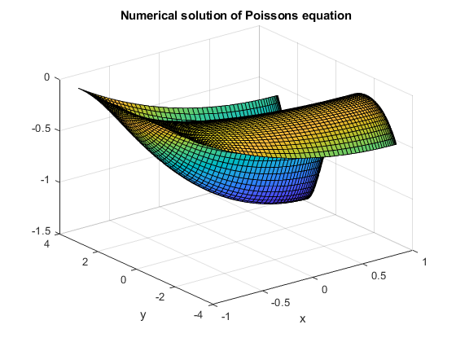
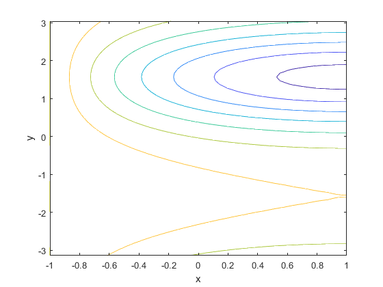
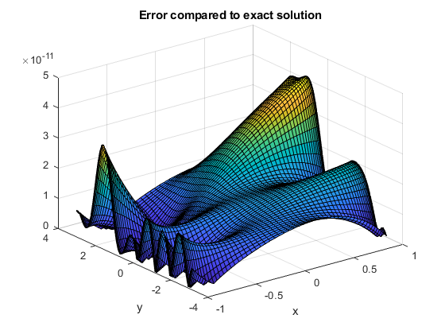

# Spectral Multigrid

Spectral Multigrid code written in Matlab.

## About:
Solves one-dimensional or two-dimensional PDEs using Spectral Multigrid.

Each direction can be discretised by either Chebyshev or Fourier collocation methods.

Supports Dirichlet, Neumann and mixed boundary conditions for Chebyshev.

## Important Notes:

Code is separated into each multigrid components:

> **Multigrid components**
* **Relaxation** - Minimum residual relaxation
* **Prolongation** - Fourier and Chebyshev
* **Restriction** - Fourier and Chebyshev
* **Preconditioner** - 2nd-order two-dimensional finite difference operator
* **Solver** - Conjugate gradient / Bicgstab, two-dimensional exact spectral matrix inversion
* **Scheme** - two-dimensional Poisson's equation

Prolongation and Restriction can easily be generalised for higher dimensions or finite difference scheme

Preconditioner, Solver and Scheme can easily be extended for different PDEs and higher dimensions or finite difference scheme

Multigrid, Minimum residual relaxation and conjugate gradient / bicgstab apply to any problems and dimensions provided the correct scheme is inputted. 

## Example solution
Poisson's equation in the rectangular domain

* Periodic boundary conditions in 
* Homogeneous Dirichlet on 
* Homogeneous Neumann on  

Exact solution is given by 

## Numerical solution

## Contours of numerical solution

## Errors (compared to exact solution)

